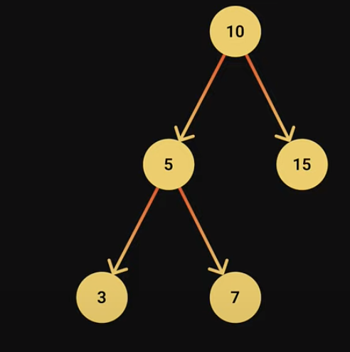
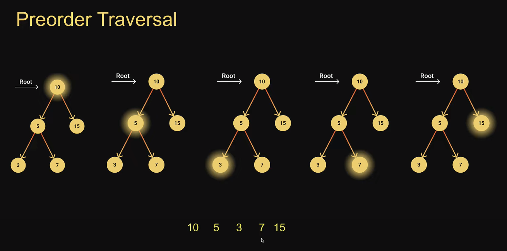
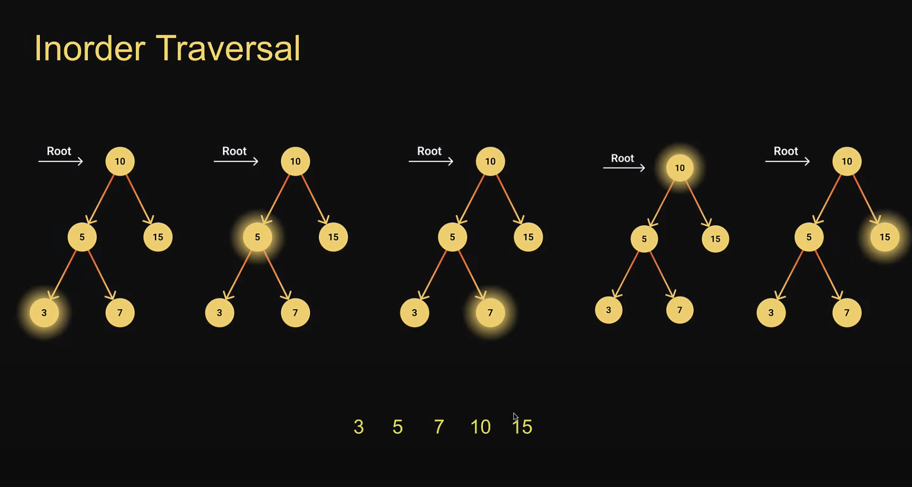
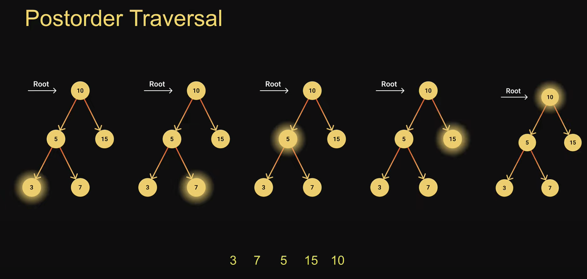
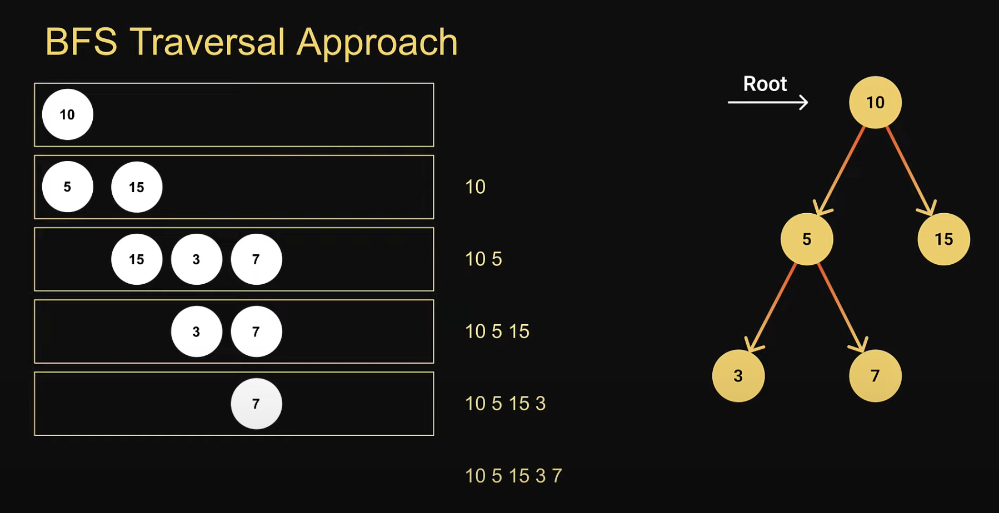

# Binary Search Tree BST

- A Binary tree is a tree that each node has at most two children. These are referred to as left child and right child.

- A Binary Search Tree is a binary tree which

  - The value of the left node must be smaller than the parent node.
  - The value of the right node must be greater than the parent node.

    

- Binary Search Tree Support these operations:
  - Insertion: To Add a node to the tree.
  - Search: to find a node given its value.
  - DFS & BFS: To visit all nodes in the tree.
  - Deletion: deleting a node given its value.

## Usage:

    - Searching
    - Sorting
    - Abstract data type such as lookup tables and priority queues.

# Implementation

```javascript,runnable
class Node {
  constructor(value) {
    this.value = value;
    this.left = null;
    this.right = null;
  }
}
class BinarySearchTree {
  constructor() {
    // when the tree is empty there is no root node
    this.root = null;
  }

  isEmpty() {
    return this.root === null;
  }
  insert(value) {
    const newNode = new Node(value);
    if (this.isEmpty()) {
      // node is the root node
      this.root = newNode;
      return
    }
    this.insertNode(this.root, newNode);
  }
  insertNode(root, newNode) {
    if (newNode.value < root.value) {
      if (!root.left) {
        root.left = newNode;
        return;
      }
      this.insertNode(root.left, newNode);
      return;
    }
    if (!root.right) {
      root.right = newNode;
      return;
    }
    this.insertNode(root.right, newNode);
    return;
  }
  search(root, searchValue) {
    if (!root) return false;
    if (root.value === searchValue) return true;

    if (searchValue < root.value) {
      return this.search(root.left, searchValue);
    }
    return this.search(root.right, searchValue);
  }
  preOrder(root){
    // DFS
    if (!root) return
    console.log(root.value)
    this.preOrder(root.left)
    this.preOrder(root.right)
  }
  inOrder(root){
    // DFS
    if (!root) return
    this.inOrder(root.left)
    console.log(root.value)
    this.inOrder(root.right)
  }
  postOrder(root){
    // DFS
    if(!root) return
    this.postOrder(root.left)
    this.postOrder(root.right)
    console.log(root.value)
  }

  levelOrder(){
    // BFS
    const queue = []
    queue.push(this.root)

    while(queue.length){

        let current = queue.shift()
        console.log(current.value)

        if(current.left){
            queue.push(current.left)
        }
        if(current.right){
            queue.push(current.right)
        }

    }

  }
  min(root){
    if (!root.left) return root.value
    return this.min(root.left)
  }
  max(root){
    if (!root.right) return root.value
    return this.max(root.right)
  }
  delete(value){
    this.root = this.deleteNode(this.root, value)
  }
 deleteNode(root,value){
    if (root === null){
        return root
    }

    if(value < root.value){
        root.left = this.deleteNode(root.left,value)
    } else if (value > root.value){
        root.right = this.deleteNode(root.right,value)
    } else {
        // leaf node => no child => remove
        if (!root.left && !root.right){
            return null
        }

        // node has only one child => replace with child
        if (!root.left){
            return root.right
        }else if (!root.right) {
            return root.left
        }

        // node has two child node left and right
        //            => replace with min(right)
        //            => Delete Replacer node
        root.value = this.min(root.right)
        root.right = this.deleteNode(root.right, root.value)
        return root
    }

 }
}

const bst = new BinarySearchTree();
console.log('Is Tree Empty?', bst.isEmpty());

bst.insert(10);
bst.insert(5);
bst.insert(15);
bst.insert(3);
bst.insert(7);
bst.preOrder(bst.root);

console.log(bst.search(bst.root, 10));
console.log(bst.search(bst.root, 5));
console.log(bst.search(bst.root, 15));
console.log(bst.search(bst.root, 1));
}

const bst = new BinarySearchTree();
console.log('Is Tree Empty?', bst.isEmpty());

bst.insert(10);
bst.insert(5);
bst.insert(15);
bst.insert(3);
bst.insert(7);
bst.preOrder();

console.log(bst.search(bst.root, 10));
console.log(bst.search(bst.root, 5));
console.log(bst.search(bst.root, 15));
console.log(bst.search(bst.root, 1));
```

# Depth First Search DFS

- PreOrder traversal

  

- InOrder Traversal

  

- PostOrder Traversal

  ## 

---

# Breadth First Search BFS

` Explore all nodes at the present depth prior to moving to the node of tge next depth level.`

1. Create a queue
1. Enqueue the root node.
1. As long as a node exists in the queue.
   1. Dequeue the node from the front.
   1. Read the node's value.
   1. Enqueue the node's left child if exists.
   1. Dequeue the node's right child if exists.



---

# Removing a Node.

1. Case node is a leaf node
   - remove the node
2. Case node to be deleted has one child node
   - Remove the node and replace it with its child
3. Case node to be deleted have 2 child node.

   - copy the value of in order successor and delete the in order successor3. Case node to be deleted have 2 child node.
   - copy the value of in order successor and delete the in order successor
