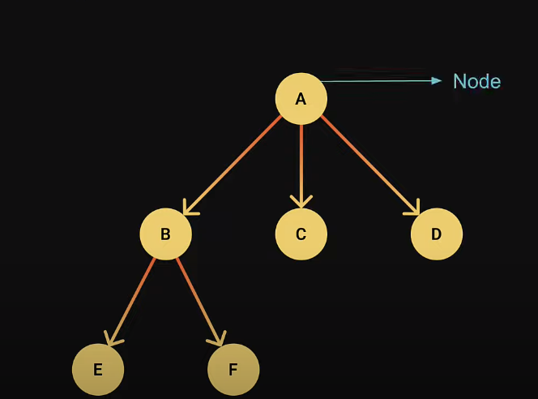
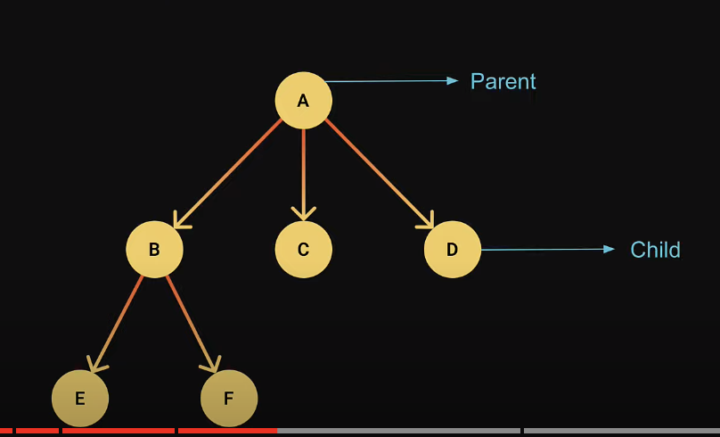
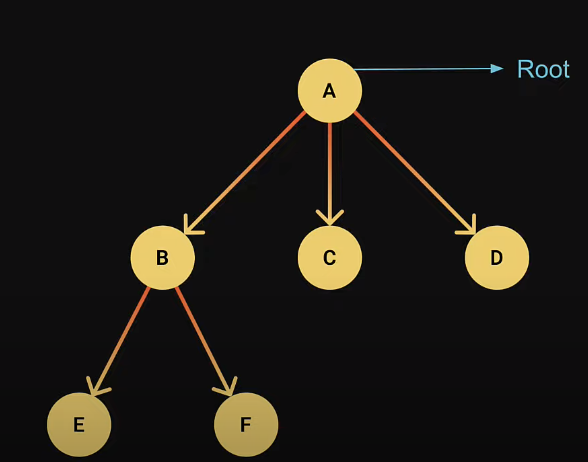
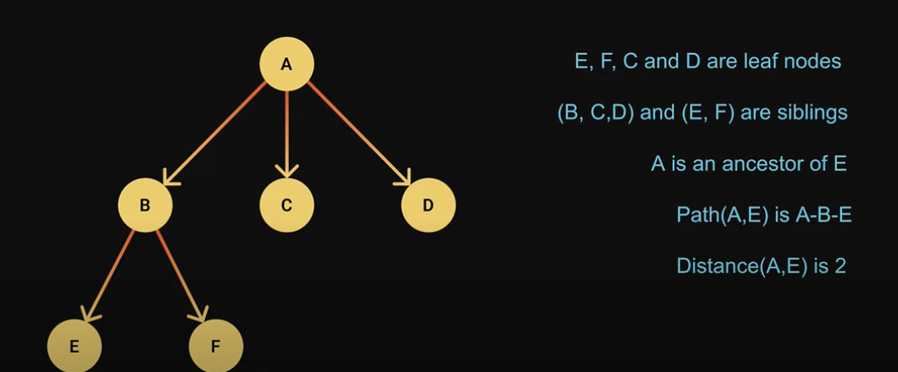
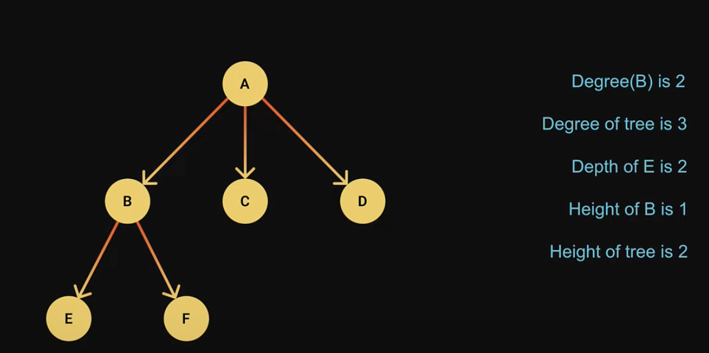

# Trees

- A tree is a hierarchical data structure that consists of nodes connected by edges.

- Not like arrays, linked lists, stacks and queues; Trees are non-liner data structure. In linear data structures time required to search is proportional to the size of the data set.

- Trees owing to the non linear nature allow quicker and easier access to the data.

- No loops or cycles.

## Example Usage:

- Dom
- Chat Bots
- Abstract syntax trees.

## Terminology:

---

### Root Node: A Node that which from the tree is originate

---

### Leaf Nodes: Nodes that does not have child nodes

### Siblings Nodes are from the same parent

### An ancestor node is the parent parent

### Path is the sequence of nodes and edges from one node to another

### Distance is the Number of edges along the shortest path between tow nodes.

---

### Degree is how many child nodes a node has.

### Degree of a tree is the max degree of a node in a tree

### Depth of a node is a number of edges from the root to that node.

### Height of a node is the number of edges from the deepest leaf to that node.

### Height of a tree is the height of the root node.

